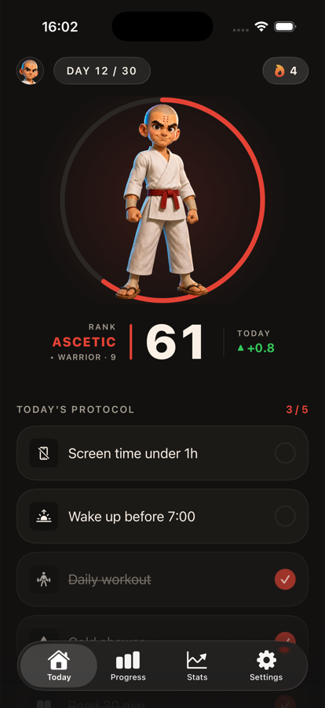
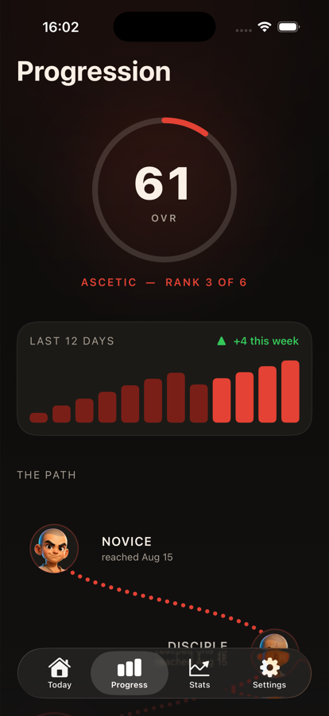
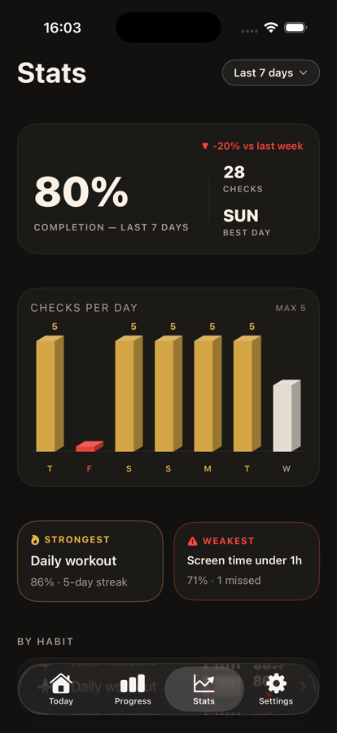
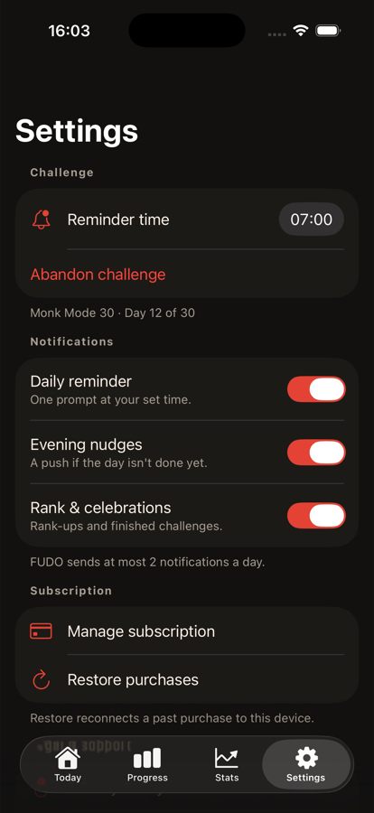

# FUDO — Monk Mode Challenge

A native iOS discipline app where you commit to a fixed-length challenge, check off your non-negotiables every day, and watch a single number — your OVR — rise or fall with your consistency.

<p align="center">
  
  
  
  
</p>

## Why I built it

Every habit tracker I tried punished a missed day by resetting the streak to zero, which is exactly the moment people quit. FUDO borrows the OVR rating from sports games instead: miss a day and the number drops, but the challenge keeps running and the number can climb back. The pressure is psychological — a falling rating, a lost rank — and nothing in the app is ever locked or blocked.

## Stack

- **Swift / SwiftUI**, iOS 17+ (`@Observable`, no UIKit outside the notification delegate)
- **SwiftData** for all persistence — 100% on-device, shared with the widget through an App Group
- **WidgetKit** — small and medium widgets reading a JSON snapshot, never SwiftData directly
- **RevenueCat** (subscriptions) and **PostHog** (product analytics, EU host) — the only two third-party dependencies
- **UNUserNotificationCenter** — local notifications only, capped at 2 per day
- No backend, no account, no sign-in. The only network calls belong to the two SDKs above.

`OVREngine` is the single source of truth for the rating formula: onboarding projection, the home screen, the daily rollover and the widget all call the same engine.

## How to run

```bash
git clone https://github.com/u8492529422-web/FUDO.git
cd FUDO
open FUDO.xcodeproj
```

Build the `FUDO` scheme against any iOS 17+ simulator — no API keys or configuration needed. Debug builds seed a full player (Monk Mode 30 at day 12, OVR 61, streak 4) so every screen has real data, and grant a local entitlement override so the paywall stays out of the way. The debug menu at the bottom of Settings resets the seed, replays the onboarding funnel, and switches the entitlement between Pro, Free and the live SDK.

Note that habits are checked with a **1-second press-and-hold**, not a tap.

Or from the command line:

```bash
xcodebuild -project FUDO.xcodeproj -scheme FUDO -destination 'platform=iOS Simulator,name=iPhone 17 Pro' build
```

## Status

Working end to end, verified on the simulator:

- Onboarding funnel — quiz, diagnostic OVR, signed protocol, paywall, post-paywall setup
- Daily checklist with hold-to-check, exact point refund on uncheck, and an anti-farming cap
- OVR engine — daily gains, miss penalties, inactivity decay, 6 sensei ranks with rank-up celebration
- Progression, Stats and Settings screens against seeded data
- End-of-challenge sequence and the loop into the next challenge
- Widget snapshots, local notification scheduling, 9:16 share card
- Paywall wired to live RevenueCat products with localized pricing and trial detection

Not done:

- **In-app purchases have never completed against a real transaction** — the App Store banking paperwork is not cleared, so the purchase path is exercised through mock products and the debug entitlement override only
- Not submitted to the App Store; no TestFlight build
- English only — the string catalog has a single base locale
- 240 unit tests pass across 27 files (OVR engine, game store, rollover, onboarding, stats aggregation, design tokens), but the UI test target is still the Xcode template stub

## License

MIT — see [LICENSE](LICENSE).
